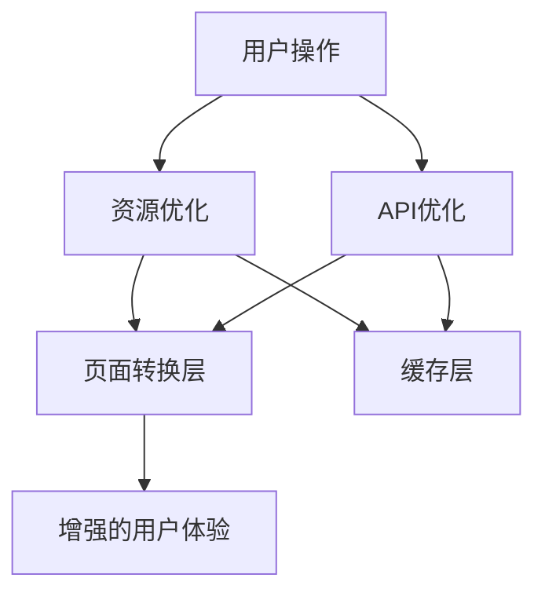

# 设计文档

## 概述

本文档概述了优化LeLeTV视频平台加载速度和页面转换性能的设计。优化重点是减少页面加载时间、改善页面间导航，并通过各种性能技术提升整体用户体验。

## 与指导文档的一致性

### 技术标准 (tech.md)
该设计遵循项目已建立的模块化JavaScript组件、懒加载实现和基于localStorage的缓存策略模式。它利用现有的实用模块并在必要时进行扩展。

### 项目结构 (structure.md)
实现将遵循现有的项目组织结构，性能优化放置在适当的模块中：
- `js/lazy-loading.js`中的懒加载增强
- `js/loadBalancer.js`中的API请求优化
- `js/cache-manager.js`中的缓存改进
- `js/watch.js`及相关文件中的页面转换优化

## 代码复用分析

### 可利用的现有组件
- **LazyLoader**：现有的图片懒加载实现将扩展到其他资源
- **LoadBalancer**：当前的API负载均衡将通过更好的性能指标进行增强
- **CacheManager**：现有的缓存管理将通过更精细的控制进行改进
- **观看/播放页面**：当前的页面转换逻辑将进行优化

### 集成点
- **API层**：性能优化将与现有的API请求处理集成
- **LocalStorage**：缓存机制将扩展当前的localStorage使用模式
- **UI组件**：加载指示器和进度反馈将与现有UI集成

## 架构

性能优化架构专注于减少资源加载时间、优化API请求和改善页面转换，通过多层方法实现：

1. **资源优化层**：处理懒加载、预加载和资源优先级
2. **API优化层**：管理请求排队、缓存和负载均衡
3. **页面转换层**：通过智能预取优化页面间导航
4. **缓存层**：实现多级缓存策略

### 模块化设计原则
- **单一文件职责**：每个优化模块处理一个特定的性能方面
- **组件隔离**：性能组件是自包含且可测试的
- **服务层分离**：将优化逻辑与业务逻辑分离
- **实用模块化**：性能实用工具是专注且可重用的



## 组件和接口

### 组件 1
- **目的：** 增强的懒加载系统
- **接口：** `observe()`, `unobserve()`, `refresh()`, `preloadResources()`
- **依赖：** IntersectionObserver API, 现有的LazyLoader类
- **复用：** 现有的LazyLoader实现，扩展用于视频预加载

### 组件 2
- **目的：** 智能API请求管理
- **接口：** `queueRequest()`, `cancelRequest()`, `getPerformanceMetrics()`, `optimizeNextRequest()`
- **依赖：** Fetch API, LoadBalancer类
- **复用：** 现有的LoadBalancer，增强性能跟踪

### 组件 3
- **目的：** 智能页面转换管理器
- **接口：** `prefetchPage()`, `transitionTo()`, `cachePageState()`, `restorePageState()`
- **依赖：** History API, 现有的页面导航逻辑
- **复用：** 观看页面转换逻辑，性能增强

## 数据模型

### 性能指标模型
```javascript
- id: string (指标收集的唯一标识符)
- timestamp: number (收集时间的Unix时间戳)
- pageLoadTime: number (毫秒)
- apiResponseTime: number (毫秒)
- resourceLoadTime: number (毫秒)
- memoryUsage: number (字节)
- cacheHitRate: number (百分比)
- userAgent: string (浏览器信息)
```

### 资源优化模型
```javascript
- resourceId: string (资源的标识符)
- url: string (资源URL)
- type: string (资源类型：图片、脚本、视频等)
- priority: number (加载优先级)
- status: string (待处理、加载中、已加载、错误)
- size: number (字节)
- loadTime: number (毫秒)
```

## 错误处理

### 错误场景
1. **场景 1：** 资源预加载失败
   - **处理：** 回退到标准懒加载，记录错误用于分析
   - **用户影响：** 资源显示略有延迟，但无功能影响

2. **场景 2：** API优化指标收集失败
   - **处理：** 使用默认优化策略，继续无增强指标
   - **用户影响：** API选择不那么智能，但仍可功能

3. **场景 3：** 页面状态缓存失败
   - **处理：** 执行无状态恢复的标准页面加载
   - **用户影响：** 返回页面时加载时间较长，但功能完整

## 测试策略

### 单元测试
- 使用模拟IntersectionObserver测试懒加载增强
- 使用模拟网络条件验证API请求优化逻辑
- 使用模拟localStorage操作验证缓存机制
- 使用导航模拟测试页面转换改进

### 集成测试
- 使用真实网络条件测试资源加载性能
- 使用多个并发请求验证API优化
- 使用实际导航流验证页面转换
- 使用重复用户旅程测试缓存效果

### 端到端测试
- 使用性能指标模拟从搜索到播放的用户旅程
- 在各种网络条件下测试页面转换
- 验证加载指示器和进度反馈
- 测量相对于基线的整体性能改进