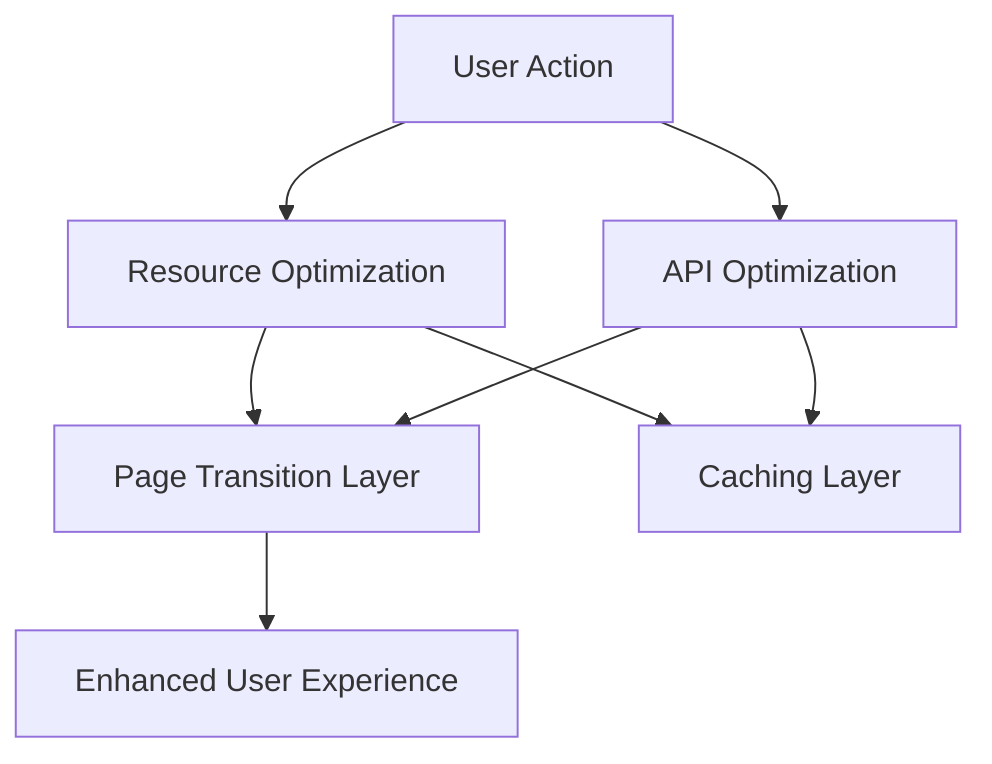

# Design Document

## Overview

This document outlines the design for optimizing the loading speed and page transition performance of the LeLeTV video platform. The optimization focuses on reducing page load times, improving navigation between pages, and enhancing the overall user experience through various performance techniques.

## Steering Document Alignment

### Technical Standards (tech.md)
The design follows the project's established patterns for modular JavaScript components, lazy loading implementation, and localStorage-based caching strategies. It leverages existing utility modules and extends them where necessary.

### Project Structure (structure.md)
The implementation will follow the existing project organization with performance optimizations placed in appropriate modules:
- Lazy loading enhancements in `js/lazy-loading.js`
- API request optimizations in `js/loadBalancer.js`
- Caching improvements in `js/cache-manager.js`
- Page transition optimizations in `js/watch.js` and related files

## Code Reuse Analysis

### Existing Components to Leverage
- **LazyLoader**: Existing image lazy loading implementation will be extended for other resources
- **LoadBalancer**: Current API load balancing will be enhanced with better performance metrics
- **CacheManager**: Existing cache management will be improved with more granular control
- **Watch/Player Pages**: Current page transition logic will be optimized

### Integration Points
- **API Layer**: Performance optimizations will integrate with existing API request handling
- **LocalStorage**: Caching mechanisms will extend current localStorage usage patterns
- **UI Components**: Loading indicators and progress feedback will integrate with existing UI

## Architecture

The performance optimization architecture focuses on reducing resource loading times, optimizing API requests, and improving page transitions through a multi-layered approach:

1. **Resource Optimization Layer**: Handles lazy loading, preloading, and resource prioritization
2. **API Optimization Layer**: Manages request queuing, caching, and load balancing
3. **Page Transition Layer**: Optimizes navigation between pages with smart prefetching
4. **Caching Layer**: Implements multi-level caching strategies

### Modular Design Principles
- **Single File Responsibility**: Each optimization module handles one specific performance aspect
- **Component Isolation**: Performance components are self-contained and testable
- **Service Layer Separation**: Separates optimization logic from business logic
- **Utility Modularity**: Performance utilities are focused and reusable



## Components and Interfaces

### Component 1
- **Purpose:** Enhanced Lazy Loading System
- **Interfaces:** `observe()`, `unobserve()`, `refresh()`, `preloadResources()`
- **Dependencies:** IntersectionObserver API, existing LazyLoader class
- **Reuses:** Existing LazyLoader implementation with extensions for video preloading

### Component 2
- **Purpose:** Intelligent API Request Management
- **Interfaces:** `queueRequest()`, `cancelRequest()`, `getPerformanceMetrics()`, `optimizeNextRequest()`
- **Dependencies:** Fetch API, LoadBalancer class
- **Reuses:** Existing LoadBalancer with enhanced performance tracking

### Component 3
- **Purpose:** Smart Page Transition Manager
- **Interfaces:** `prefetchPage()`, `transitionTo()`, `cachePageState()`, `restorePageState()`
- **Dependencies:** History API, existing page navigation logic
- **Reuses:** Watch page transition logic with performance enhancements

## Data Models

### Performance Metrics Model
```javascript
- id: string (unique identifier for metrics collection)
- timestamp: number (Unix timestamp of collection)
- pageLoadTime: number (milliseconds)
- apiResponseTime: number (milliseconds)
- resourceLoadTime: number (milliseconds)
- memoryUsage: number (bytes)
- cacheHitRate: number (percentage)
- userAgent: string (browser information)
```

### Resource Optimization Model
```javascript
- resourceId: string (identifier for the resource)
- url: string (resource URL)
- type: string (resource type: image, script, video, etc.)
- priority: number (loading priority)
- status: string (pending, loading, loaded, error)
- size: number (bytes)
- loadTime: number (milliseconds)
```

## Error Handling

### Error Scenarios
1. **Scenario 1:** Resource preloading fails
   - **Handling:** Fall back to standard lazy loading, log error for analytics
   - **User Impact:** Slight delay in resource display, but no functional impact

2. **Scenario 2:** API optimization metrics collection fails
   - **Handling:** Use default optimization strategies, continue without enhanced metrics
   - **User Impact:** Less intelligent API selection, but still functional

3. **Scenario 3:** Page state caching fails
   - **Handling:** Perform standard page loads without state restoration
   - **User Impact:** Longer load times when returning to pages, but full functionality

## Testing Strategy

### Unit Testing
- Test lazy loading enhancements with mock IntersectionObserver
- Validate API request optimization logic with mock network conditions
- Verify caching mechanisms with simulated localStorage operations
- Test page transition improvements with navigation mocks

### Integration Testing
- Test resource loading performance with real network conditions
- Validate API optimization with multiple concurrent requests
- Verify page transitions with actual navigation flows
- Test caching effectiveness with repeated user journeys

### End-to-End Testing
- Simulate user journeys from search to playback with performance metrics
- Test page transitions under various network conditions
- Validate loading indicators and progress feedback
- Measure overall performance improvements against baseline