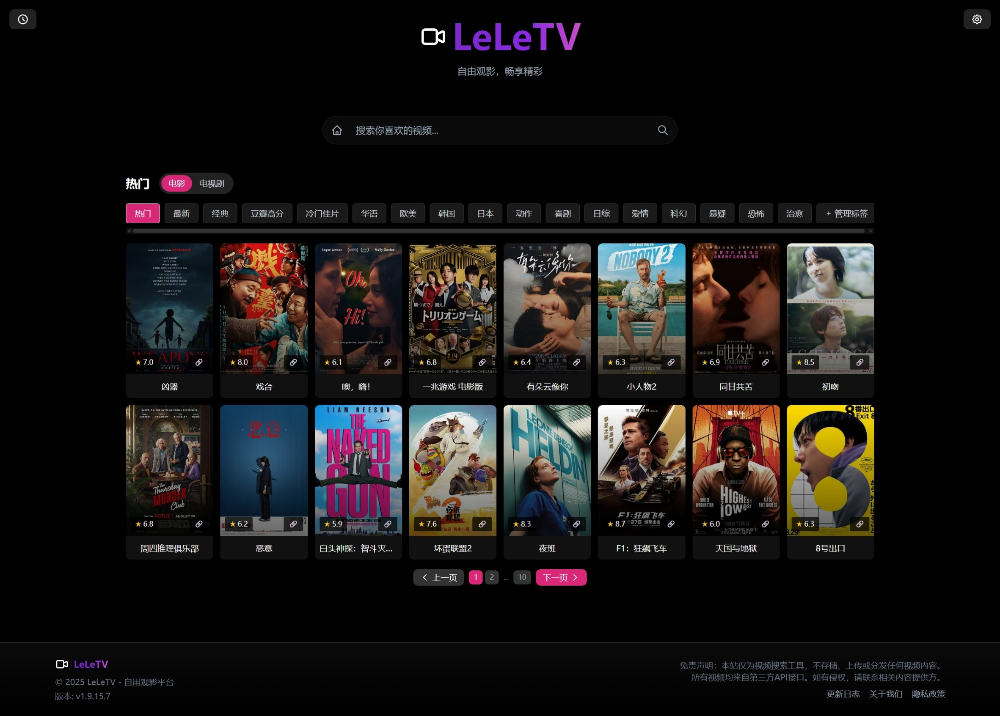

# LeLeTV - 自用观影平台

<div align="center">
  
  <br>
  <p><strong>私有学习项目，禁止公开使用</strong></p>
</div>

## 📺 项目简介

LeLeTV 是一个**私有库**，仅用于作者个人学习和技术研究用途。该项目是一个轻量级的在线视频搜索与观看平台原型，结合了前端技术和后端代理功能，用于学习现代Web开发技术和服务部署方法。

<!-- 居中对齐 -->
<div align="center">
  
</div>

## 🚨 重要声明

- 本项目**仅供个人学习使用**，禁止用于任何商业用途
- 本项目**必须设置密码保护**，禁止公开分享或部署为公共服务
- 如因违反上述规定导致的任何法律问题，使用者需自行承担责任
- 项目开发者不对用户的使用行为承担任何法律责任

## 🔒 密码保护

**重要提示**: 为确保安全，所有部署都必须设置 `PASSWORD` 环境变量，否则用户将看到设置密码的提示。

您还可以设置 `ADMINPASSWORD` 环境变量来启用隐藏内容过滤功能的管理权限。

## 📋 部署指南

### Cloudflare Pages 部署

1. Fork 或克隆本仓库到您的 GitHub 账户
2. 登录 [Cloudflare Dashboard](https://dash.cloudflare.com/)，进入 Pages 服务
3. 点击"创建项目"，连接您的 GitHub 仓库
4. 使用以下设置：
   - 构建命令：留空（无需构建）
   - 输出目录：留空（默认为根目录）
5. **⚠️ 关键步骤：在"设置" > "环境变量"中添加 `PASSWORD` 变量**
6. （可选）添加 `ADMINPASSWORD` 变量以启用隐藏内容过滤功能的管理权限
7. 点击"保存并部署"

### 本地部署

1. 克隆本仓库到本地
2. 安装依赖：`npm install`
3. 设置环境变量：
   - `PASSWORD`（必填）- 用户访问密码
   - `ADMINPASSWORD`（可选）- 管理员密码，用于管理隐藏内容过滤功能
4. 启动本地服务器：`npm start` 或 `node server.mjs`
5. 在浏览器中访问：`http://localhost:8080`

## ⚙️ 环境变量配置

| 变量名 | 必填 | 说明 |
|--------|------|------|
| `PASSWORD` | 是 | 用户访问密码，必须设置 |
| `ADMINPASSWORD` | 是 | 管理员密码，用于管理隐藏内容过滤功能 |
| `PORT` | 否 | 服务器端口，默认为 8080 |
| `CORS_ORIGIN` | 否 | CORS 允许的源，默认为 * |
| `REQUEST_TIMEOUT` | 否 | 请求超时时间（毫秒），默认为 5000 |
| `MAX_RETRIES` | 否 | 请求最大重试次数，默认为 2 |
| `CACHE_MAX_AGE` | 否 | 静态资源缓存时间，默认为 1d |
| `USER_AGENT` | 否 | 请求 User-Agent，默认为 Chrome |

## 🌐 功能特性

- 🔍 视频搜索：支持多数据源视频搜索
- ▶️ 视频播放：集成 HLS.js 播放器，支持多种视频格式
- 🎛️ 播放控制：支持上下集切换、自动连播、播放进度保存
- 📱 响应式设计：适配桌面端和移动端设备
- 🔒 密码保护：访问需密码验证，确保私有使用
- 🛡️ 隐藏内容过滤：可过滤伦理片等隐藏内容（需管理员密码）
- 🌐 代理服务：内置视频代理服务，解决跨域问题
- 📡 负载均衡：多数据源负载均衡，提高可用性
- 📚 观看历史：自动记录观看历史
- 🎨 现代化UI：采用 Tailwind CSS 构建，具有赛博朋克风格设计
- 📱 PWA支持：支持安装为桌面应用

## ⚠️ 免责声明

本项目仅作为学习工具，不存储、上传或分发任何视频内容。所有视频均来自第三方 API 接口提供的搜索结果。如有侵权内容，请联系相应的内容提供方。

本项目开发者不对使用本项目产生的任何后果负责。使用本项目时，您必须遵守当地的法律法规。

## 🛠️ 技术栈

- **前端技术**：HTML5 + CSS3 + JavaScript (ES6+)
- **样式框架**：Tailwind CSS
- **播放器**：ArtPlayer（基于 HLS.js）
- **后端技术**：Node.js + Express
- **代理服务**：服务端 HLS 代理和处理技术
- **部署平台**：Cloudflare Pages / 本地部署
- **其他**：PWA 支持、Service Worker 缓存

## 📝 学习目标

- 掌握现代前端技术栈的应用
- 学习服务端无服务器函数开发
- 理解视频流处理和代理技术
- 熟悉 Cloudflare 等平台的部署流程
- 提升 Web 应用安全防护意识
- 实践响应式设计和移动端适配

## 📈 性能优化

- 🚀 懒加载：图片和资源懒加载，提升页面加载速度
- 💾 缓存管理：Service Worker 缓存静态资源，24小时自动清理本地存储
- 🔄 负载均衡：多数据源负载均衡，提高服务可用性
- 🎯 请求优化：请求超时和重试机制，提升稳定性

## 📚 目录结构

```
LeLeTV/
├── api/              # API代理服务
├── css/              # 样式文件
├── functions/        # Cloudflare Functions
├── image/            # 图片资源
├── js/               # JavaScript文件
├── libs/             # 第三方库
├── scripts/          # 脚本文件
├── .gitignore        # Git忽略文件
├── CHANGELOG.md      # 更新日志
├── CONTRIBUTING.md   # 贡献指南
├── README.md         # 项目说明
├── manifest.json     # PWA配置文件
├── package.json      # 项目配置
├── server.mjs        # 服务器入口文件
├── service-worker.js # Service Worker文件
└── ...               # HTML页面文件
```

## 🔄 版本管理

项目采用语义化版本控制，版本号格式为 `v{年}.{月}.{日}.{当天提交序号}`。

每次提交代码时，系统会自动从 CHANGELOG.md 中提取最新版本号创建 Git 标签。如果提交信息中包含 `@CHANGELOG.md`，则跳过自动标签创建过程。

可以通过以下方式手动创建标签：

```bash
npm run tag
```

## 🛠️ 开发指南

1. 克隆项目：`git clone`
2. 安装依赖：`npm install`
3. 启动开发服务器：`npm run dev`
4. 访问应用：`http://localhost:8080`

## 📤 贡献

欢迎提交 Issue 和 Pull Request 来改进本项目。请阅读 [CONTRIBUTING.md](CONTRIBUTING.md) 了解更多详情。

## 🙏 鸣谢

感谢 [LibreTV](https://github.com/LibreSpark/LibreTV) 项目及其作者，本学习项目基于其代码结构和设计思路进行了修改和调整，用于个人学习和技术研究目的。

## 📧 联系方式

如有好的功能建议，或者有什么其他问题，欢迎[联系作者](mailto:jiunian929@gmail.com)