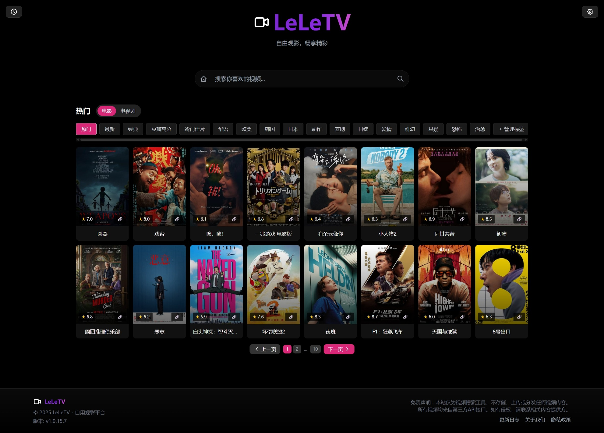

# LeLeTV - 乐乐影视

<div align="center">
  
  <br>
  <p><strong>私有学习项目，禁止公开使用</strong></p>
</div>

<p align="center">
  <a href="https://leletv.776645.xyz" target="_blank">🌐 在线访问</a> · 
  <a href="#-功能特性">功能特性</a> · 
  <a href="#-技术栈">技术栈</a> · 
  <a href="#-部署指南">部署指南</a> ·
  <a href="#-目录结构">目录结构</a>
</p>

---

## 📺 项目简介

LeLeTV 是一个自用的在线视频搜索与观看平台，仅用于个人学习和技术研究。项目以纯前端单页应用（SPA）为核心，聚合多路第三方视频采集站 API 实现搜索和播放，通过 **TMDB（The Movie Database）** 提供分类浏览、影片详情和智能筛选功能。

部署采用 **Cloudflare Pages + Cloudflare Workers** 的纯静态+无服务器架构，无需后端服务器即可运行。

<!-- 居中对齐 -->
<div align="center">
  
</div>

## 🚨 重要声明

- 本项目**仅供个人学习使用**，禁止用于任何商业用途
- 本项目**必须设置密码保护**，禁止公开分享或部署为公共服务
- 如因违反上述规定导致的任何法律问题，使用者需自行承担责任
- 本项目开发者不对用户的使用行为承担任何法律责任

## 🔒 密码保护

所有部署都必须设置 `PASSWORD` 环境变量，否则用户将看到设置密码的提示。

您还可以设置 `ADMINPASSWORD` 环境变量来启用隐藏内容过滤功能的管理权限。

> 注意：在 Cloudflare Pages 部署时，密码通过 Pages Functions Middleware 注入到 HTML 模板中，前端使用 SHA-256 哈希进行代理认证。

## 🌐 功能特性

### 🔍 视频搜索
- 聚合 10+ 个第三方视频采集站 API，支持多源并发搜索
- 搜索结果缓存（5 分钟有效期），减少重复请求
- 最近搜索历史记录（最多保留 5 条）

### 🎬 TMDB 分类浏览
- 通过 TMDB API 获取影片数据，支持 **电影 / 电视剧 / 动漫 / 综艺** 四大类型
- **多维筛选**：按类型流派（Genre）、年份（含折叠展开）、评分、语言、国家、剧集状态进行过滤
- 多种排序方式：热门程度、评分高低、上映日期、名称排序等
- 智能分页，响应式网格布局

### ▶️ 视频播放
- 基于 **ArtPlayer**（集成 HLS.js）的播放器，支持多种视频流格式
- **多资源切换**：播放时可在不同视频源之间切换，实时显示各源延迟
- **上下集切换**：支持剧集导航，连续追剧体验
- **自动连播**：当前集播放结束后自动播放下一集
- **手机横屏自动全屏**：检测设备方向自动进入全屏
- **Window Controls Overlay**：PWA 模式下实现原生窗口控制栏

### 📡 智能负载均衡
- 根据 API 的健康状态、响应时间、成功率和当前负载动态选择最佳数据源
- 定期健康检查，自动标记不健康的 API 并实现故障转移
- 黑名单机制：连续失败的 API 自动冷却，冷却期后重新评估
- **可视化状态面板**：实时显示各 API 源的健康状态、成功率、响应时间和负载情况

### 💾 智能缓存管理
- 自动清理过期的临时数据，释放存储空间
- 保护用户设置和历史记录（选中的 API 源、观看历史等）
- 可配置清理间隔和数据保留策略
- 支持手动触发缓存清理

### 📚 观看历史
- 自动记录观看进度（集数和播放位置）
- 分组式卡片布局，左侧封面右侧内容
- 进度条显示观看完成度
- 支持单条删除和清空全部

### 🎨 用户界面
- **赛博朋克/霓虹美学**风格，粉色（#ec4899）主色调
- 单页应用架构，页面切换无刷新
- 响应式设计，适配桌面端和移动端
- 深色模式

### 📱 PWA 支持
- 支持安装为桌面/移动应用
- Service Worker 静态资源预缓存
- Window Controls Overlay（窗口控制栏覆盖），增强原生感
- 版本检测自动提示更新

### 🔧 自定义 API
- 支持用户手动添加自定义视频采集站 API
- 可删除和管理已添加的自定义源

### 📊 版本管理
- 语义化版本号格式 `v{年偏移}.{月}.{日}.{当日提交序号}`
- 自动版本检测与更新提示
- 关于页面内嵌完整更新日志（从 CHANGELOG.md 动态加载）

## 🛠️ 技术栈

| 层 | 技术 |
|------|------|
| **前端** | HTML5 + CSS3 + JavaScript (ES6+) |
| **样式** | Tailwind CSS（PostCSS 构建） |
| **播放器** | ArtPlayer（基于 HLS.js） |
| **后端（本地）** | Node.js + Express |
| **部署平台** | Cloudflare Pages（前端 + 代理） |
| **无服务器函数** | Cloudflare Workers（TMDB API 代理） |
| **PWA** | Service Worker + Web App Manifest |
| **密码安全** | SHA-256 哈希（proxy-auth） |
| **构建工具** | Node.js 脚本（版本生成、样式构建） |

## 🏗️ 架构说明

### 部署架构

```
用户浏览器
    │
    ├── Cloudflare Pages ── 静态资源（HTML/CSS/JS）
    │       └── Pages Functions Middleware ── 密码注入
    │
    ├── Cloudflare Worker ── TMDB API 代理（分类浏览、影片详情）
    │       └── wrangler.toml 配置
    │
    └── 第三方采集站 API ── 视频搜索和播放源（前端直连）
```

### 本地开发架构

```
用户浏览器
    │
    ├── Node.js + Express（server.mjs）
    │       ├── 静态资源服务
    │       ├── 视频代理（/proxy/*）
    │       ├── TMDB 代理（/api/tmdb）
    │       └── 密码注入（HTML 模板替换）
    │
    └── 第三方采集站 API ── 视频搜索和播放源
```

> **说明**：项目最初使用 Node.js + Express 作为完整后端，后因 Cloudflare Pages 不支持运行 Node.js，将 TMDB 功能迁移到 Cloudflare Worker，视频代理迁移到 Pages Functions，实现了纯静态+无服务器的生产部署方案。

## 📋 部署指南

### 第一步：获取 TMDB API 密钥

TMDB（The Movie Database）提供免费的影片数据 API，获取密钥的步骤如下：

1. 访问 [TMDB 官网](https://www.themoviedb.org/)，点击右上角 **加入 TMDB**，注册账号并验证邮箱
2. 登录后，点击右上角头像 → **账户设置**
3. 在左侧菜单找到 **API**，点击 **请求 API 密钥** 下方的 "click here"
4. 选择 **Developer** 类型（免费），填写申请表单：
   - **用途/名称**：例如 "LeLeTV Personal Use"
   - **应用 URL**：选填，可填你的 Pages 域名
   - **简介**：可填 "Meet personalized needs, enrich website interfaces and functions"
5. 提交后即可看到你的 **API 密钥 (v3 auth)**，复制保存备用

> TMDB API 密钥是免费的，个人使用足够。申请后立即生效，无需等待审核。

### 第二步：部署 Cloudflare Worker（TMDB 代理）

TMDB API 在前端直接调用会遇到跨域限制，需要通过 Cloudflare Worker 中转：

1. 登录 [Cloudflare Dashboard](https://dash.cloudflare.com/)，进入 **Workers & Pages**
2. 点击 **创建应用程序** → **创建 Worker**
3. 给 Worker 命名（例如 `leletv-tmdb-proxy`），点击 **部署**
4. 部署后点击 **编辑代码**，将项目 `workers/tmdb-worker.js` 的全部内容粘贴覆盖默认代码，点击 **保存并部署**
5. 回到 Worker 页面，进入 **设置** → **变量**：
   - 在 **环境变量** 栏，添加变量名 `TMDB_API_KEY`，值填入第一步获取的 API 密钥
   - 点击 **保存并部署**
6. （可选，但推荐）绑定自定义域名：
   - 在 Worker **设置** → **触发器** → **自定义域名**，添加一个你拥有的域名（如 `tmdb-proxy.yourdomain.com`）
   - 没有自定义域名也可以使用 Cloudflare 提供的 `*.workers.dev` 域名
7. 记录 Worker 的访问地址，例如：
   - 自定义域名：`https://tmdb-proxy.yourdomain.com`
   - workers.dev 域名：`https://leletv-tmdb-proxy.xxx.workers.dev`

> **验证 Worker 是否正常工作**：在浏览器中访问 `https://你的worker域名/health`，返回 `{"status":"ok"}` 即表示部署成功。

### 第三步：部署 Cloudflare Pages（前端）

1. Fork 或克隆本仓库到你的 GitHub 账户
2. 进入 **Cloudflare Dashboard** → **Workers & Pages** → **创建应用程序** → **Pages** → **连接到 Git**
3. 授权并选择你的仓库
4. 构建设置：
   - **构建命令**：`npm run build`
   - **输出目录**：`dist`
   - **根目录**：`/`（使用默认即可）
5. 点击 **保存并部署**，首次部署会自动运行
6. 部署完成后，进入 Pages 项目的 **设置** → **环境变量**，添加以下变量：

   | 变量名 | 必填 | 值 |
   |--------|------|-----|
   | `PASSWORD` | **是** | 设置你的访问密码（纯文本，前端会做 SHA-256 哈希验证）|
   | `TMDB_WORKER_URL` | 推荐 | 第二步中记录的 Worker 地址，例如 `https://tmdb-proxy.yourdomain.com` |
   | `ADMINPASSWORD` | 否 | 管理员密码，用于管理隐藏内容过滤 |

7. 添加完成后，进入 Pages **部署** 页面，点击最后一个部署的 **...** → **重试部署**，让新环境变量生效

> ⚠️ **注意**：
> - 部署前端时必须设置 `PASSWORD` 变量，否则页面会一直提示设置密码
> - `TMDB_WORKER_URL` **不要加末尾斜杠**
> - `TMDB_API_KEY` 是 Worker 的环境变量，**不要**填到 Pages 的环境变量中

> **提示**：每次构建时会自动运行 `generate-version.mjs` 脚本，生成基于时间戳的版本号，更新 HTML 中的资源缓存参数和 Service Worker 缓存版本。

### 验证整个流程

部署完成后，按以下顺序验证：
1. 访问你的 Pages 域名（如 `https://你的项目.pages.dev`），应该弹出密码验证
2. 输入你在 `PASSWORD` 中设置的密码，进入首页
3. 点击导航栏的 **分类** 按钮，应该能看到 TMDB 的电影/电视剧列表
4. 如果分类页面无法加载内容，检查：
   - Worker 的 `/health` 端点是否返回 `{"status":"ok"}`
   - Pages 的 `TMDB_WORKER_URL` 是否填写正确（不要末尾斜杠）
   - Worker 的 `TMDB_API_KEY` 是否已正确设置

### 本地开发部署

1. 克隆本仓库到本地
2. 安装依赖：`npm install`
3. 复制环境变量文件：`cp .env.example .env`，并按需修改配置
4. 构建 CSS：`npm run build`
5. 启动开发服务器：`npm run dev`（支持 nodemon 热重载）
6. 在浏览器中访问：`http://localhost:8080`

## ⚙️ 环境变量配置

| 变量名 | 必填 | 说明 |
|--------|------|------|
| `PASSWORD` | 是 | 用户访问密码 |
| `ADMINPASSWORD` | 否 | 管理员密码，用于管理隐藏内容过滤 |
| `TMDB_WORKER_URL` | 否 | Cloudflare Worker 地址（`TMDB_API_KEY` 配置在 Worker 环境变量中，不是 Pages）|
| `PORT` | 否 | 本地服务器端口（默认 8080） |
| `CORS_ORIGIN` | 否 | CORS 允许的源（默认 *） |
| `REQUEST_TIMEOUT` | 否 | 请求超时（毫秒，默认 5000） |
| `MAX_RETRIES` | 否 | 请求最大重试次数（默认 2） |
| `CACHE_MAX_AGE` | 否 | 静态资源缓存时间（默认 1d） |
| `USER_AGENT` | 否 | 请求 User-Agent |
| `DEBUG` | 否 | 调试模式（默认 false） |

## 📁 目录结构

```
LeLeTV/
├── api/                    # Cloudflare Pages Functions
│   └── proxy/              #   视频代理函数
│       └── [...path].mjs   #     通配路由处理
├── css/                    # 样式文件
│   ├── styles.css          #   全局样式
│   ├── index.css           #   首页样式
│   ├── player.css          #   播放器样式
│   ├── watch.css           #   观看页样式
│   ├── tailwind.css        #   Tailwind 入口
│   └── output.css          #   Tailwind 编译输出
├── docs/                   # 文档
│   └── VERSION_RULES.md    #   版本号规则说明
├── dist/                   # 构建输出（生产部署）
│   ├── _redirects
│   ├── assets/
│   ├── index.html
│   ├── manifest.json
│   └── service-worker.js
├── functions/              # Vercel/Netlify 兼容中间件
│   ├── _middleware.js
│   └── proxy/
├── image/                  # 图片资源
│   ├── logo.png
│   ├── logo-black.png
│   └── nomedia.png
├── js/                     # JavaScript 模块
│   ├── config.js           #   全局配置（API 列表、常量）
│   ├── app.js              #   主入口（初始化、页面逻辑）
│   ├── search.js           #   视频搜索模块
│   ├── player.js           #   播放器模块（独立页面）
│   ├── watch.js            #   观看页面逻辑
│   ├── tmdb.js             #   TMDB 分类浏览模块
│   ├── loadBalancer.js     #   负载均衡核心
│   ├── loadBalancerUI.js   #   负载均衡状态面板 UI
│   ├── cache-manager.js    #   智能缓存管理
│   ├── password.js         #   密码验证
│   ├── proxy-auth.js       #   代理认证（SHA-256）
│   ├── ui.js               #   UI 工具函数
│   ├── api.js              #   API 工具函数
│   ├── customer_site.js    #   自定义 API 管理
│   ├── index-page.js       #   首页交互逻辑
│   ├── version-check.js    #   版本检查
│   ├── version-updater.js  #   版本更新自动检测
│   ├── version-utils.js    #   版本工具函数
│   └── sha256.js           #   SHA-256 哈希实现
├── libs/                   # 第三方库
│   └── sha256.min.js
├── scripts/                # 自动化脚本
│   ├── generate-version.mjs  # 版本号生成
│   ├── create-tag.js         # Git 标签创建
│   ├── update-version.js     # 版本更新
│   ├── update-all-versions.js # 全量版本同步
│   ├── changelog-updater.js  # 更新日志维护
│   ├── version-tracker.js    # 版本跟踪
│   ├── create-historical-releases.js
│   ├── create-releases.ps1
│   └── test-auto-release.js
├── workers/                # Cloudflare Workers
│   └── tmdb-worker.js      #   TMDB API 代理 Worker
├── .env                    # 本地环境变量（不提交）
├── .env.example            # 环境变量模板
├── .gitignore
├── _headers                # Cloudflare Pages 缓存头策略
├── index.html              # 主页面（SPA 入口）
├── player.html             # 播放器独立页面
├── watch.html              # 观看页面
├── about.html              # 关于页面
├── manifest.json           # PWA 配置
├── middleware.js            # Vercel 中间件
├── package.json
├── postcss.config.js
├── server.mjs              # Node.js 本地服务器
├── service-worker.js       # Service Worker
├── tailwind.config.js      # Tailwind CSS 配置
├── wrangler.toml           # Cloudflare Workers 配置
├── LICENSE                 # Apache-2.0
├── CHANGELOG.md            # 更新日志
├── CONTRIBUTING.md         # 贡献说明
└── README.md               # 本文件
```

## 🔄 版本管理

项目采用语义化版本号格式：`v{年偏移}.{月}.{日}.{当天提交序号}`

- **年偏移**：2025 年为 1，之后每年递增
- **当天提交序号**：基于当日时间计算（每 5 分钟一个槽位）

版本号自动生成流程（`scripts/generate-version.mjs`）：
1. 生成基于时间戳的原始版本号 `YYYYMMDDHHmm`
2. 写入 `VERSION.txt`
3. 替换 HTML 中的 `{{LELETV_VERSION}}` 占位符
4. 更新 `service-worker.js` 中的 `CACHE_VERSION`
5. 为 CSS/JS 引用添加版本缓存参数 `?v=`

手动创建 Git 标签：

```bash
npm run tag
```

## 🛠️ 开发指南

```bash
# 克隆项目
git clone https://github.com/JiuNian090/leletv.git
cd leletv

# 安装依赖
npm install

# 配置环境变量
cp .env.example .env
# 编辑 .env，设置 PASSWORD 等变量

# 构建样式
npm run build

# 启动开发服务器（带热重载）
npm run dev

# 访问应用
# http://localhost:8080
```

### npm 脚本

| 命令 | 说明 |
|------|------|
| `npm run dev` | nodemon 热重载开发服务器 |
| `npm start` | 生产模式启动 |
| `npm run build` | 生成版本 + Tailwind 构建 |
| `npm run tag` | 手动创建 Git 版本标签 |

## 📡 缓存策略

项目针对 Cloudflare Pages 部署实施了精细化的缓存策略（详见 `_headers`）：

| 文件类型 | 缓存策略 | 说明 |
|---------|---------|------|
| `.html` | `no-cache` | 每次请求回源校验 |
| `CHANGELOG.md` | `no-cache` | 实时获取最新版本历史 |
| `.css`, `.js`, 图片 | `public, max-age=604800, immutable` | 缓存 7 天，配合 `?v=` 参数做缓存失效 |

## ⚠️ 免责声明

本项目仅作为学习工具，不存储、上传或分发任何视频内容。所有视频均来自第三方 API 接口提供的搜索结果。如有侵权内容，请联系相应的内容提供方。

本项目开发者不对使用本项目产生的任何后果负责。使用本项目时，您必须遵守当地的法律法规。

## 📧 联系方式

如有好的功能建议或问题，欢迎[联系作者](mailto:jiunian929@gmail.com)。
