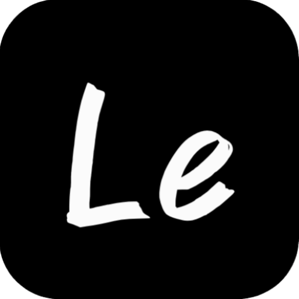

# LeLeTV - 自用观影平台

  
   
  
<strong>私有学习项目，禁止公开使用</strong>

## 📺 项目简介

LeLeTV 是一个**私有库**，仅用于作者个人学习和技术研究用途。该项目是一个轻量级的在线视频搜索与观看平台原型，结合了前端技术和后端代理功能，用于学习现代Web开发技术和服务部署方法。

## 🚨 重要声明

- 本项目**仅供个人学习使用**，禁止用于任何商业用途
- 本项目**必须设置密码保护**，禁止公开分享或部署为公共服务
- 如因违反上述规定导致的任何法律问题，使用者需自行承担责任
- 项目开发者不对用户的使用行为承担任何法律责任

## 🔒 密码保护

**重要提示**: 为确保安全，所有部署都必须设置 PASSWORD 环境变量，否则用户将看到设置密码的提示。

## 📋 部署指南

### Cloudflare Pages 部署

1. Fork 或克隆本仓库到您的 GitHub 账户
2. 登录 [Cloudflare Dashboard](https://dash.cloudflare.com/)，进入 Pages 服务
3. 点击"创建项目"，连接您的 GitHub 仓库
4. 使用以下设置：
   - 构建命令：留空（无需构建）
   - 输出目录：留空（默认为根目录）
5. **⚠️ 关键步骤：在"设置" > "环境变量"中添加 `PASSWORD` 变量**
6. 点击"保存并部署"

### 本地部署

1. 克隆本仓库到本地
2. 安装依赖：`npm install`
3. 设置环境变量 `PASSWORD`（必填）
4. 启动本地服务器：`node server.mjs`
5. 在浏览器中访问：`http://localhost:3000`

## ⚠️ 免责声明

本项目仅作为学习工具，不存储、上传或分发任何视频内容。所有视频均来自第三方 API 接口提供的搜索结果。如有侵权内容，请联系相应的内容提供方。

本项目开发者不对使用本项目产生的任何后果负责。使用本项目时，您必须遵守当地的法律法规。

## 🛠️ 技术栈

- HTML5 + CSS3 + JavaScript (ES6+)
- Tailwind CSS
- HLS.js 用于 HLS 流处理
- Cloudflare Serverless Functions
- 服务端 HLS 代理和处理技术

## 📝 学习目标

- 掌握现代前端技术栈的应用
- 学习服务端无服务器函数开发
- 理解视频流处理和代理技术
- 熟悉 Cloudflare 等平台的部署流程
- 提升 Web 应用安全防护意识

## 鸣谢

感谢 [LibreTV](https://github.com/LibreSpark/LibreTV) 项目及其作者，本学习项目基于其代码结构和设计思路进行了修改和调整，用于个人学习和技术研究目的。

## 📧 联系方式

如有好的功能建议，或者有什么其他问题，欢迎联系作者：

  邮箱：jiunian929@gmail.com

在网站页面中点击上方邮箱地址，将会自动复制到剪贴板并显示成功提示。
