# Spec-Workflow 规范开发工作流指导文档

## 概述

Spec-Workflow 是一个规范驱动的开发系统，通过 MCP 工具引导用户将粗糙的想法转化为详细的规范文档。工作流包含四个阶段：需求分析 → 设计 → 任务分解 → 实现阶段。功能名称使用 kebab-case 命名法（例如：user-authentication），每次只创建一个规范。

## 工作流图示

```mermaid
flowchart TD
    Start([开始: 用户请求功能]) --> CheckSteering{是否存在引导文档?}
    CheckSteering -->|是| P1_Load[获取引导上下文]
    CheckSteering -->|否| P1_Template
    
    %% 阶段 1: 需求分析
    P1_Load --> P1_Template[获取模板上下文<br/>templateType: spec<br/>template: requirements]
    P1_Template --> P1_Research[网络搜索（如果可用）]
    P1_Research --> P1_Create[创建规范文档<br/>document: requirements]
    P1_Create --> P1_Approve[请求审批<br/>仅提供文件路径]
    P1_Approve --> P1_Status[获取审批状态<br/>轮询状态]
    P1_Status --> P1_Check{状态?}
    P1_Check -->|需要修订| P1_Update[根据用户意见更新文档]
    P1_Update --> P1_Create
    P1_Check -->|已批准| P1_Clean[删除审批]
    P1_Clean -->|失败| P1_Status
    
    %% 阶段 2: 设计
    P1_Clean -->|成功| P2_Template[获取模板上下文<br/>templateType: spec<br/>template: design]
    P2_Template --> P2_Analyze[分析代码库模式]
    P2_Analyze --> P2_Create[创建规范文档<br/>document: design]
    P2_Create --> P2_Approve[请求审批<br/>仅提供文件路径]
    P2_Approve --> P2_Status[获取审批状态<br/>轮询状态]
    P2_Status --> P2_Check{状态?}
    P2_Check -->|需要修订| P2_Update[根据用户意见更新文档]
    P2_Update --> P2_Create
    P2_Check -->|已批准| P2_Clean[删除审批]
    P2_Clean -->|失败| P2_Status
    
    %% 阶段 3: 任务分解
    P2_Clean -->|成功| P3_Template[获取模板上下文<br/>templateType: spec<br/>template: tasks]
    P3_Template --> P3_Break[将设计转换为任务]
    P3_Break --> P3_Create[创建规范文档<br/>document: tasks]
    P3_Create --> P3_Approve[请求审批<br/>仅提供文件路径]
    P3_Approve --> P3_Status[获取审批状态<br/>轮询状态]
    P3_Status --> P3_Check{状态?}
    P3_Check -->|需要修订| P3_Update[根据用户意见更新文档]
    P3_Update --> P3_Create
    P3_Check -->|已批准| P3_Clean[删除审批]
    P3_Clean -->|失败| P3_Status
    
    %% 阶段 4: 实现
    P3_Clean -->|成功| P4_Ready[规范完成。<br/>准备实现?]
    P4_Ready -->|是| P4_Status[规范状态]
    P4_Status --> P4_Task[任务管理<br/>action: set-status<br/>status: in-progress]
    P4_Task --> P4_Code[实现代码]
    P4_Code --> P4_Complete[任务管理<br/>action: set-status<br/>status: completed]
    P4_Complete --> P4_More{更多任务?}
    P4_More -->|是| P4_Task
    P4_More -->|否| End([实现完成])
    
    style Start fill:#e1f5e1
    style End fill:#e1f5e1
    style P1_Check fill:#ffe6e6
    style P2_Check fill:#ffe6e6
    style P3_Check fill:#ffe6e6
    style CheckSteering fill:#fff4e6
    style P4_More fill:#fff4e6
```

## 规范工作流详解

### 阶段 1: 需求分析
**目的**: 基于用户需求定义要构建的内容。

**工具**:
- get-steering-context: 检查项目指南（如果已建立代码库）
- get-template-context: 加载需求模板（templateType: "spec", template: "requirements"）
- create-spec-doc: 创建 requirements.md
- request-approval: 获取用户审批
- get-approval-status: 检查审批状态
- delete-approval: 审批后清理

**流程**:
1. 检查是否存在引导文档（询问用户是否为已建立的代码库创建引导文档）
2. 加载需求模板
3. 研究市场需求/用户期望（如果网络搜索可用）
4. 生成符合 EARS 标准的用户故事需求
5. 使用 create-spec-doc 创建文档
6. 请求审批（仅提供文件路径，从不提供内容）
7. 轮询状态直到已批准/需要修订（从不接受口头审批）
8. 如果需要修订：更新文档，创建新的审批，不要继续
9. 一旦批准：在继续之前必须成功删除审批
10. 如果删除审批失败：停止 - 返回轮询

### 阶段 2: 设计
**目的**: 创建解决所有需求的技术设计。

**工具**:
- get-template-context: 加载设计模板（templateType: "spec", template: "design"）
- create-spec-doc: 创建 design.md
- request-approval: 获取用户审批
- get-approval-status: 检查状态
- delete-approval: 清理

**流程**:
1. 加载设计模板
2. 分析代码库以重用模式
3. 研究技术选择（如果网络搜索可用）
4. 生成包含所有模板部分的设计
5. 创建文档并请求审批
6. 轮询状态直到已批准/需要修订
7. 如果需要修订：更新文档，创建新的审批，不要继续
8. 一旦批准：在继续之前必须成功删除审批
9. 如果删除审批失败：停止 - 返回轮询

### 阶段 3: 任务分解
**目的**: 将设计分解为原子实现任务。

**工具**:
- get-template-context: 加载任务模板（templateType: "spec", template: "tasks"）
- create-spec-doc: 创建 tasks.md
- request-approval: 获取用户审批
- get-approval-status: 检查状态
- delete-approval: 清理

**流程**:
1. 加载任务模板
2. 将设计转换为原子任务（每个任务1-3个文件）
3. 包含文件路径和需求引用
4. 创建文档并请求审批
5. 轮询状态直到已批准/需要修订
6. 如果需要修订：更新文档，创建新的审批，不要继续
7. 一旦批准：在继续之前必须成功删除审批
8. 如果删除审批失败：停止 - 返回轮询
9. 成功清理后："规范完成。准备实现？"

### 阶段 4: 实现
**目的**: 系统化地执行任务。

**工具**:
- spec-status: 检查总体进度
- manage-tasks: 跟踪和更新任务状态
- get-spec-context: 如果返回工作则加载规范

**流程**:
1. 使用 spec-status 检查当前状态
2. 对于每个任务：
   - manage-tasks 操作："set-status"，状态："in-progress"
   - 实现代码
   - manage-tasks 操作："set-status"，状态："completed"
3. 继续直到所有任务完成

## 工作流规则

- 始终使用 MCP 工具，从不手动创建文档
- 严格遵循模板结构
- 在阶段之间获取明确的用户审批
- 按顺序完成阶段（不能跳过）
- 一次只处理一个规范
- 使用 kebab-case 命名规范名称
- 审批请求：仅提供文件路径，从不提供内容
- 阻塞：如果删除审批失败则从不继续
- 关键：必须具有已批准状态和成功的清理才能进入下一阶段
- 关键：从不接受口头审批 - 仅通过仪表板或 VS Code 扩展
- 从不在用户说"已批准"时继续 - 仅检查系统状态
- 引导文档是可选的 - 仅在明确要求时创建

## 下一步操作

1. 遵循顺序：需求分析 → 设计 → 任务分解 → 实现
2. 首先使用 get-template-context 加载模板
3. 每个文档后请求审批
4. 仅使用 MCP 工具
5. 在仪表板上监控进度：http://localhost:49301